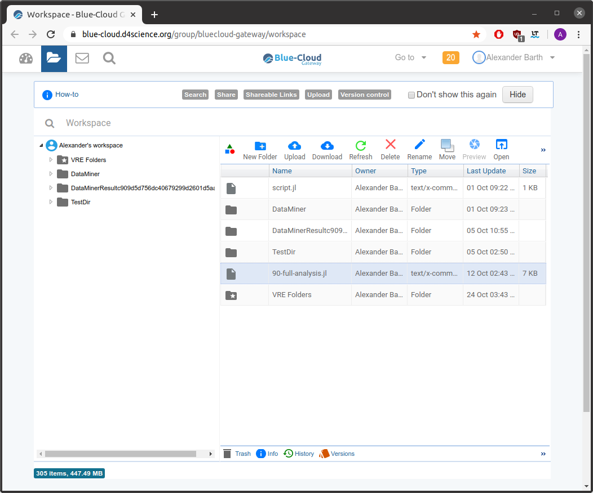
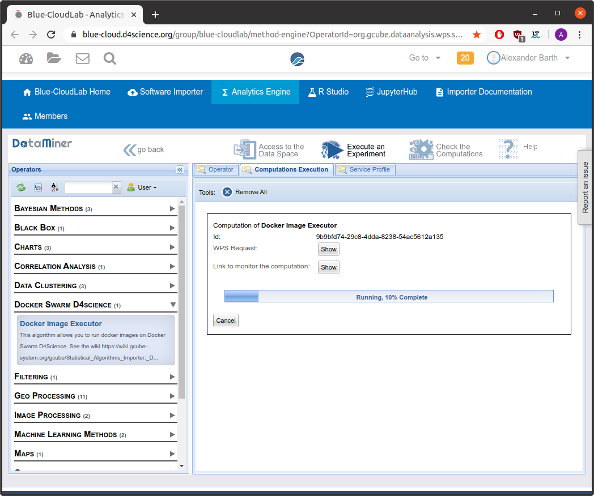

[](https://travis-ci.org/gher-ulg/DIVAnd-BlueCloud) [](https://zenodo.org/badge/latestdoi/271015819) 


# Docker image

The image is available from the [Docker hub](https://hub.docker.com/repository/docker/abarth/divand-bluecloud):

```julia
docker pull abarth/divand-bluecloud:latest
```

## Run DIVAnd on BlueCloud


* Login to [BlueCloud](https://blue-cloud.d4science.org)


* Upload a Julia script file to your [workspace](https://blue-cloud.d4science.org/group/bluecloud-gateway/workspace). All additional files need to be downloaded from the julia script with e.g. the `download` function. Within the workspace file can be shared via a link and downloaded from the script using this link.



* Open the [docker image executor](https://blue-cloud.d4science.org/group/blue-cloudlab/method-engine?OperatorId=org.gcube.dataanalysis.wps.statisticalmanager.synchserver.mappedclasses.transducerers.DOCKER_IMAGE_EXECUTOR) and use the following parameters:
     * Image: `abarth/divand-bluecloud`
     * CommandName: `DIVAnd`
     * FileParam: choose the julia script


* Click on `Start Computation`.



* All files in the current working directory of the julia script will be saved and transferred to your workspace (the `DataMiner/Output Data Sets` folder).
Do not place the final results in to subfolders as they will not be transferred.
